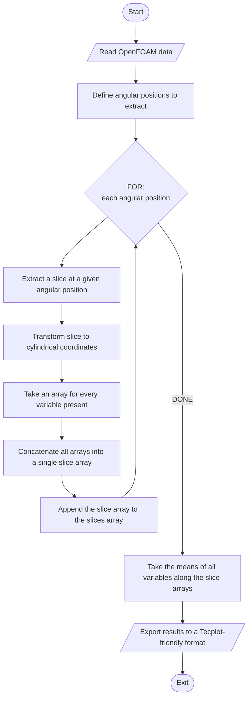

<style type="text/css">@page { size: B5; margin-left: 0.05in; margin-right: 0.05in }</style>

# Azimuthal Average of OpenFOAM results

## Conceptual Design



## Cylindrical transformation for vectorial and tensorial quantities

### Vectors

$$
\vec u: \text{Vector in cartesian coordinates }(u_x, u_y, u_z) \\
\vec v: \text{Vector in cylindrical coordinates } (v_r, v_t, v_z)
$$

As a general rule,
$$
\large v_r = u_x\cos\theta +u_y\sin \theta \\
\large v_t = -u_x\sin \theta + u_y\cos \theta \\
\large v_z = u_z
$$

### Tensors

$$
T: \text{Tensor in cartesian coordinates} \\ 

\begin{bmatrix}
T_{xx} & T_{xy} & T_{xz} \\
T_{yx} & T_{yy} & T_{yz} \\
T_{zx} & T_{zy} & T_{zz}\\
\end{bmatrix}
\\

R: \text{Tensor in cylindrical coordinates} \\

\begin{bmatrix}
R_{rr} & R_{rt} & R_{rz} \\
R_{tr} & R_{tt} & R_{tz} \\
R_{zr} & R_{zt} & R_{zz}\\
\end{bmatrix}
\\
$$

For the particular case in which $T$ and $R$ are symmetric tensors,
$$
\begin{align}
R_{rr} &= T_{xx}\cos^2\theta+2T_{xy}\sin\theta\cos\theta + T_{yy}\sin^2\theta\\
R_{tt} &= T_{xx}\sin^2\theta-2T_{xy}\sin\theta\cos\theta +T_{yy}\cos^2\theta \\
R_{zz} &= T_{zz} \\
R_{zt} &= -T_{xz}\sin\theta+T_{yz}\cos\theta \\
R_{zr} &= T_{xz}\cos\theta+T_{yz}\sin\theta \\
R_{rt} &= \big(T_{yy}-T_{xx}\big)\cos\theta\sin\theta+T_{xy}(\cos^2\theta-sin^2\theta)
\end{align}
$$

### Rotation Matrix

Both vector and tensor transformations can be summarized into a single operation using lineal algebra.

Let,

$$
Q: \text{Rotation Matrix}
$$
Where,
$$
Q=
\begin{bmatrix}
\cos\theta & \sin\theta & 0 \\
-\sin\theta & \cos\theta & 0 \\
0 & 0 & 1\\
\end{bmatrix}
$$


The following holds:

$$
\vec v=Q\cdot\vec u\\
R=Q\cdot T\cdot Q^T
$$


```python
def get_cartesian_to_cylindrical_rotation_matrix(radial_vector):
    sin_t, cos_t = radial_vector.get_sin_t_and_cos_t()
    return np.array(
        [[cos_t, sin_t, 0],
         [-sin_t, cos_t, 0],
         [0, 0, 1]]
    )


r"""
/*---------------------------------*\

             VECTORS

\*---------------------------------*/
"""


class CartesianVector:
    """Class for vectors in cartesian coordinates.

    Instance attributes:

    self.vector -- numpy array containing the vector
    self.x -- radial component
    self.y -- azimuthal component
    self.z -- axial component
    """

    def __init__(self, array_like):
        """Constructor for a CylindricalVector instance.

        Arguments:

        array_like -- Array like structure ordered as (x_comp, y_comp, z_comp)
        """
        self.vector = np.array(array_like)
        self.x = self.vector[0]
        self.y = self.vector[1]
        self.z = self.vector[2]
        return

    def get_sin_t_and_cos_t(self):
        radial_magnitude = np.sqrt(self.y**2 + self.x**2)
        return self.y / radial_magnitude, self.x / radial_magnitude

    def get_magnitude(self):
        return np.sqrt(self.vector.dot(self.vector))

    def convert_to_cylindrical(self, position_vector):
        rotation_matrix = get_cartesian_to_cylindrical_rotation_matrix(position_vector)

        cylindrical_vector_array = rotation_matrix.dot(self.vector)
        return CylindricalVector(cylindrical_vector_array)

    def __str__(self):
        return f"{self.vector}"


class CylindricalVector:
    """Class for vectors in cylindrical coordinates.

    Instance attributes:

    self.vector -- numpy array containing the vector
    self.r -- radial component
    self.t -- azimuthal component
    self.z -- axial component
    """

    def __init__(self, array_like):
        """Constructor for a CylindricalVector instance.

        Arguments:

        array_like -- Array like structure ordered as (r_comp, t_comp, z_comp)
        """
        self.vector = np.array(array_like)
        self.r = self.vector[0]
        self.t = self.vector[1]
        self.z = self.vector[2]
        return

    def __str__(self):
        return f"{self.vector}"


r"""
/*---------------------------------*\

             TENSORS

\*---------------------------------*/
"""


def rotate_tensor(tensor, rotation_matrix):
    return rotation_matrix.dot(tensor.dot(rotation_matrix.T))


class SymmetricCartesianTensor:

    list_of_components = ["xx", "xy", "xz", "yy", "yz", "zz"]

    def __init__(self, array_like):
        for comp, array_elem in zip(SymmetricCartesianTensor.list_of_components, array_like):
            setattr(self, comp, array_elem)
        self.tensor = np.array(
            [[self.xx, self.xy, self.xz],
             [self.xy, self.yy, self.yz],
             [self.xz, self.yz, self.zz]]
        )
        return

    def convert_to_cylindrical(self, radial_vector):
        rotation_matrix = get_cartesian_to_cylindrical_rotation_matrix(radial_vector)
        cylindrical_tensor_array = rotate_tensor(self.tensor, rotation_matrix)
        return SymmetricCylindricalTensor(cylindrical_tensor_array[np.triu_indices(3)])

    def __str__(self):
        return f"{self.tensor}"


class SymmetricCylindricalTensor:
    list_of_components = ["rr", "rt", "rz", "tt", "tz", "zz"]

    def __init__(self, array_like):
        for comp, array_elem in zip(SymmetricCylindricalTensor.list_of_components, array_like):
            setattr(self, comp, array_elem)
        self.tensor = np.array(
            [[self.rr, self.rt, self.rz],
             [self.rt, self.tt, self.tz],
             [self.rz, self.tz, self.zz]]
        )
    def __str__(self):
        return f"{self.tensor}"

        
```

